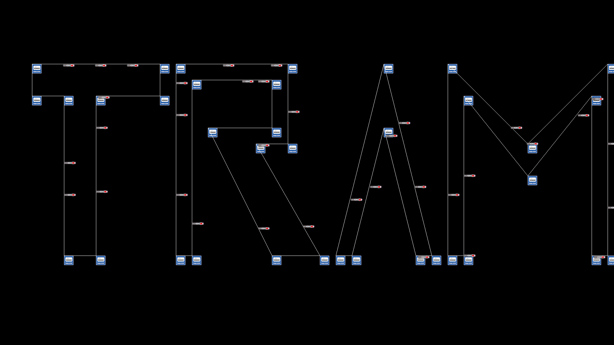

# Tramnet

*Stwórz swoją własną sieć tramwajową!* :train:

## Instalacja

W celu instalacji należy pobrać **wszystkie** pliki udostępnione w tym repozytorium. Najłatwiej będzie to zrobić za pomocą komendy:

 >git clone {link do tego repozytorium}

wpisując ją w terminal swojego środowiska programistycznego. Następnie należy pobrać wymagane do działania programu biblioteki, których nazwy i wersje podane są w pliku `requirements.txt`. Najłatwiej zrobić to za pomocą jednej komendy wpisanej do terminala:

>python -m pip install -r .\requirements.txt

Ważne jest zainstalowanie plików graficznych z koncówką `.png` dzięki którym w symulacji wyświetlały się będą obrazy.

## Sposób użycia

Po umieszczeniu wszystkich potrzebnych plików w swoim środowisku uruchom plik `main.py` za pomocą komendy w terminalu:
>python main.py

lub przy pomocy swojego IDE(w przypadku VSCode: `Ctrl + F5`)

Po uruchomieniu programu, w terminalu wyświetli się `Menu`, które pokieruje cię w jaki sposób możesz dodać
linie i przystanki do swojej symulacji. Aby wyświetlić symulację należy dodać co najmniej jedną linię, a w każdej z linii przynajmniej 2 przystanki. Przystanki rozmieszczamy po ekranie podając ich koordynaty(piksele).

## Ustawienia

Możliwe jest ustawienie rozdzielczości wyświetlanej symulacji. W tym celu należy ręcznie wprowadzić szerokość i długość w pliku `settings.txt` i zapisać zmiany. **Nie należy** wprowadzać ujemnych wartości. Domyślna rozdzielczość programu to **1920/1080**. Możliwe jest również manipulowanie czasem, który tramwaj spędza na przystanku ,,biorąc pasażerów". W tym celu ustawiamy 'cyknięcia zegara'. Domyślna wartość to **100**.

